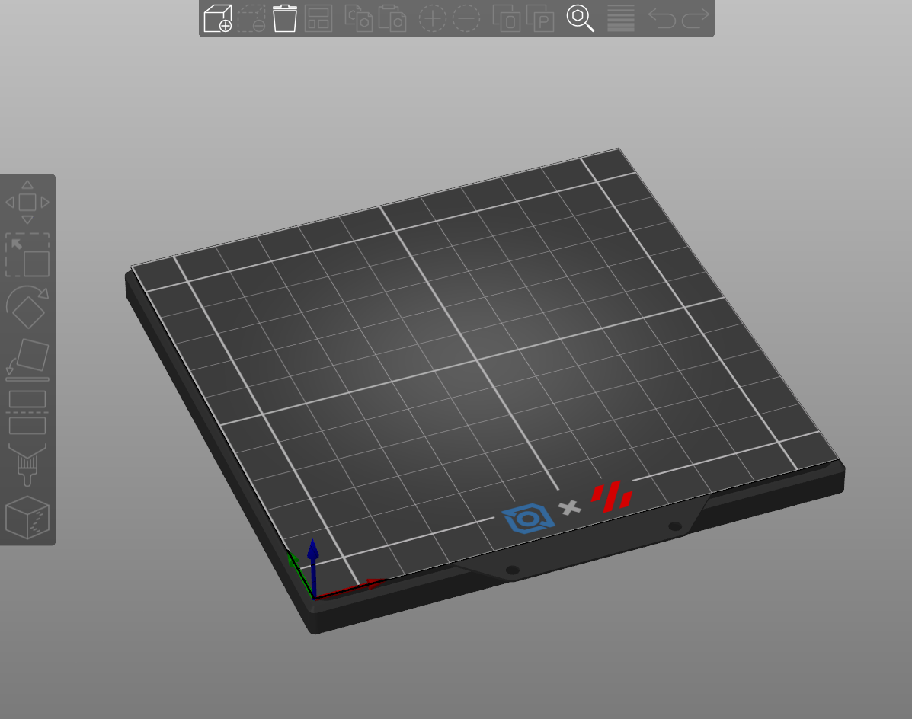

# Slicer Plate Models & Textures
This folder contains models and textures that can be used in SuperSlicer or PrusaSlicer. Open Printer Settings->General->Bed Shape. 
- Under Texture, select "120_ldo_texture.svg"
- Under Model, select "Voron_120_Build_Plate.stl"

